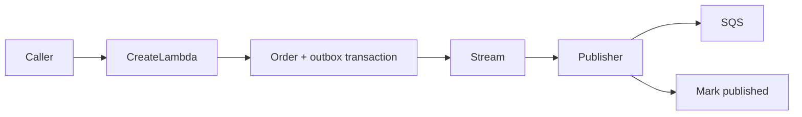

# Transactional Outbox

## Problem and design

Persist an order and its pending event in one DynamoDB transaction. A stream-triggered Lambda loads the durable event, publishes to SQS, and only then marks it published. The operator can replay a known event ID after a downstream outage.



Read `src/outbox.ts`, `src/stream.ts`, the thin `*-handler.ts` adapters, and `terraform/main.tf`. `fixtures/order.json` returns the order ID and a duplicate flag. Reusing an ID with different content fails; same-content retries reuse the persisted event.

## Prerequisites and local verification

Node.js 24, pnpm 10.32.0, zip, and Terraform 1.16.3. Docker is needed for the repository's DynamoDB Local integration tests. Unit tests, builds, Terraform validation and mocked Terraform tests use no AWS account. The default CI does not deploy.

```bash
pnpm install --frozen-lockfile
pnpm test -- scenarios/10-transactional-outbox/tests
pnpm build 10-transactional-outbox
pnpm test:integration
pnpm terraform:check
```

## Configuration and safety

`ORDERS_TABLE` and `OUTBOX_TABLE` select the two tables; dispatchers additionally receive `QUEUE_URL`. IAM separates order creation, stream publication, and explicit replay. The stream exposes keys only, filters INSERT, uses partial batch failure responses, retries at most three times, and limits record age to one hour. Polling is disabled until `enable_workers=true`.

Pending events have no automatic TTL: stream retention is finite, so the complete payload remains in the outbox for deliberate recovery. The failure SQS destination contains stream failure metadata, not a substitute for the stored business event. Inspect pending items in bounded pages and replay each approved ID with `fixtures/replay.json`. Published rows also remain available for deduplication; define an archival window before adding TTL.

The provider requires an explicit 12-digit `target_account_id` and refuses other accounts. Choose `region` and a short `environment` name. Logs retain seven days. `enable_alarms` defaults to false; optionally provide existing SNS topics through `alarm_action_arns`. Review [security and cost controls](../../docs/security-and-cost.md) and [deployment/state guidance](../../docs/deployment.md) before applying anything.

## Deploy, exercise, and destroy

Only in the intended sandbox account, after reviewing the plan:

```bash
terraform -chdir=scenarios/10-transactional-outbox/terraform init
terraform -chdir=scenarios/10-transactional-outbox/terraform plan -var="target_account_id=$AWS_ACCOUNT_ID" -out=plan.tfplan
terraform -chdir=scenarios/10-transactional-outbox/terraform apply plan.tfplan
```

Set the shell variables below from the named Terraform outputs. These commands invoke real services and can incur charges; they are not part of CI.

```bash
terraform -chdir=scenarios/10-transactional-outbox/terraform output
aws lambda invoke --function-name "$CREATE_FUNCTION" --cli-binary-format raw-in-base64-out --payload file://scenarios/10-transactional-outbox/fixtures/order.json response.json
aws lambda invoke --function-name "$REPLAY_FUNCTION" --cli-binary-format raw-in-base64-out --payload file://scenarios/10-transactional-outbox/fixtures/replay.json replay-response.json
```

Read the function names and queue URL from Terraform outputs. Invoke create twice and confirm the second response is a duplicate. After enabling the stream worker, inspect one queue message and verify its stable `eventId`; check the outbox status. For failure recovery, disable polling, create another unique order, then explicitly replay its event ID and confirm publication. Do not delete a pending row to unblock a retry.

A crash between SQS acceptance and marking publication can send the same event twice. Consumers must deduplicate by business/event ID; the outbox solves the database/message dual-write gap, not exactly-once external side effects. Transaction capacity is limited to 10 read/write request units per second per table. The shared queue also provisions a DLQ; this scenario leaves business consumers to the caller. Costs include table storage, transactional writes, stream invocations, SQS, and logs.

After inspecting the results, disable any enabled workers, stop active executions, and destroy only this scenario's sandbox resources:

```bash
terraform -chdir=scenarios/10-transactional-outbox/terraform destroy -var="target_account_id=$AWS_ACCOUNT_ID"
```

## Official references

- [Transactional outbox pattern](https://docs.aws.amazon.com/prescriptive-guidance/latest/cloud-design-patterns/transactional-outbox.html)
- [DynamoDB stream partial batch responses](https://docs.aws.amazon.com/lambda/latest/dg/services-ddb-batchfailurereporting.html)
