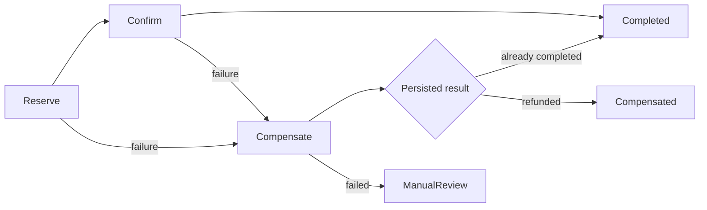

# Compensating Workflow with Step Functions

## Problem and design

Use a Standard Step Functions workflow to reserve stock, confirm simulated fulfillment, and compensate a failed fulfillment. The example has no payment processor or external commercial side effect.



Read `workflow.asl.json`, `src/reservations.ts`, `src/handler.ts`, and the Terraform root. Requests contain an immutable business ID, SKU, quantity 1–10, and a simulation flag. `fixtures/success.json` ends successfully; `fixtures/compensate.json` ends with `FulfillmentCompensated` after returning the reserved stock.

## Prerequisites and local verification

Node.js 24, pnpm 10.32.0, zip, and Terraform 1.16.3. Docker is needed for the repository's DynamoDB Local integration tests. Unit tests, builds, Terraform validation and mocked Terraform tests use no AWS account. The default CI does not deploy.

```bash
pnpm install --frozen-lockfile
pnpm test -- scenarios/11-compensating-workflow/tests
pnpm build 11-compensating-workflow
pnpm test:integration
pnpm terraform:check
```

## Configuration and safety

`TABLE_NAME` contains stock rows and reservations. Seed `stock#widget` once using `fixtures/stock-item.json` before a test. Re-seeding during concurrent activity would overwrite inventory; use a fresh environment or SKU.

Each task has a 20-second timeout, a 15-second Lambda, and two bounded retries for transient invocation failures with full jitter. The complete workflow has a five-minute timeout. Lambda concurrency defaults to two. State-machine execution role can invoke only its worker; worker DynamoDB permissions are limited to its table. There are no automatic triggers or schedules. State history contains only synthetic IDs, SKU, quantities, and error information; never submit secrets or personal data.

The provider requires an explicit 12-digit `target_account_id` and refuses other accounts. Choose `region` and a short `environment` name. Logs retain seven days. `enable_alarms` defaults to false; optionally provide existing SNS topics through `alarm_action_arns`. Review [security and cost controls](../../docs/security-and-cost.md) and [deployment/state guidance](../../docs/deployment.md) before applying anything.

## Deploy, exercise, and destroy

Only in the intended sandbox account, after reviewing the plan:

```bash
terraform -chdir=scenarios/11-compensating-workflow/terraform init
terraform -chdir=scenarios/11-compensating-workflow/terraform plan -var="target_account_id=$AWS_ACCOUNT_ID" -out=plan.tfplan
terraform -chdir=scenarios/11-compensating-workflow/terraform apply plan.tfplan
```

Set the shell variables below from the named Terraform outputs. These commands invoke real services and can incur charges; they are not part of CI.

```bash
aws dynamodb put-item --table-name "$TABLE_NAME" --item file://scenarios/11-compensating-workflow/fixtures/stock-item.json --condition-expression 'attribute_not_exists(id)'
aws stepfunctions start-execution --state-machine-arn "$STATE_MACHINE_ARN" --name reservation-001 --input file://scenarios/11-compensating-workflow/fixtures/success.json
aws stepfunctions start-execution --state-machine-arn "$STATE_MACHINE_ARN" --name reservation-002 --input file://scenarios/11-compensating-workflow/fixtures/compensate.json
```

Read `table_name` and `state_machine_arn` from Terraform outputs. Seed stock at 10. Run the success request (stock becomes 8), then the compensation request (stock returns to 8). Inspect execution history and reservation rows. Use a new business ID for a new business attempt; keep the same ID for recovery of the same request.

Reservation and decrement are atomic. Compensation and refund are atomic and idempotent. A tombstone prevents a delayed reservation after compensation. Confirmation racing compensation can produce only a completed reservation or a refunded one. If confirmation already committed despite a timeout, compensation observes COMPLETED and the workflow succeeds without refunding.

An operator stop, top-level workflow timeout, or uncatchable runtime failure does not guarantee compensation runs. Inspect persisted state and deliberately invoke the worker's `compensate` action for the original request; repeated compensation is safe. `CompensationNeedsReview` also requires inspection, never blind creation of a new reservation. External fulfillment integrations need their own idempotency and reconciliation protocol. Costs include Standard workflow transitions, Lambda, DynamoDB transactions/storage, and logs.

After inspecting the results, disable any enabled workers, stop active executions, and destroy only this scenario's sandbox resources:

```bash
terraform -chdir=scenarios/11-compensating-workflow/terraform destroy -var="target_account_id=$AWS_ACCOUNT_ID"
```

## Official references

- [Saga orchestration](https://docs.aws.amazon.com/prescriptive-guidance/latest/cloud-design-patterns/saga-orchestration.html)
- [Step Functions error handling](https://docs.aws.amazon.com/step-functions/latest/dg/concepts-error-handling.html)
