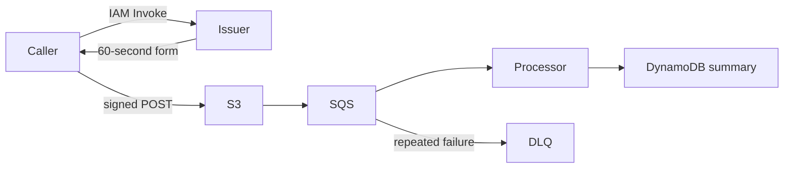

# Secure S3 Upload

## Problem and design

Issue a short-lived presigned POST for a small JSON document, then validate an immutable object version asynchronously. The issuer is invoked through authenticated Lambda Invoke; no public signing endpoint is created.



Read `src/upload.ts`, `src/issue-handler.ts`, `src/process-handler.ts`, and `terraform/main.tf`. `fixtures/request.json` requests application/json; the response supplies the URL and every required form field. `fixtures/document.json` produces recordCount 1 and totalQuantity 2. Only a summary and object identity are persisted.

## Prerequisites and local verification

Node.js 24, pnpm 10.32.0, zip, and Terraform 1.16.3. Docker is needed for the repository's DynamoDB Local integration tests. Unit tests, builds, Terraform validation and mocked Terraform tests use no AWS account. The default CI does not deploy.

```bash
pnpm install --frozen-lockfile
pnpm test -- scenarios/12-secure-upload/tests
pnpm build 12-secure-upload
pnpm test:integration
pnpm terraform:check
```

## Configuration and safety

`BUCKET_NAME` is used by both Lambdas and `TABLE_NAME` by the processor. The issuer fixes the object key to a random UUID under incoming/, content type to application/json, size to 1–1,048,576 bytes, server-side encryption to AES256, and expiry to 60 seconds. Never log or share returned form fields: they are temporary bearer credentials.

S3 blocks all public access, enforces TLS, disables ACLs, encrypts objects, and enables versioning. The processor reads only the exact version in the notification using GetObjectVersion; reusing a form cannot substitute a later version for an earlier event. A signed form can be reused before expiry and can create multiple versions, so restrict who may invoke the issuer. Content type alone is not validation: the processor checks bytes, UTF-8, JSON, bounded record counts, IDs, quantities, and duplicates.

Current/noncurrent objects expire after one day through lifecycle rules; deletion is asynchronous. Result TTL is also asynchronous. Processors are disabled until `enable_workers=true`. Only ObjectCreated:Post events under incoming/ ending in .json are processed. No processor writes to S3, avoiding notification loops.

The provider requires an explicit 12-digit `target_account_id` and refuses other accounts. Choose `region` and a short `environment` name. Logs retain seven days. `enable_alarms` defaults to false; optionally provide existing SNS topics through `alarm_action_arns`. Review [security and cost controls](../../docs/security-and-cost.md) and [deployment/state guidance](../../docs/deployment.md) before applying anything.

## Deploy, exercise, and destroy

Only in the intended sandbox account, after reviewing the plan:

```bash
terraform -chdir=scenarios/12-secure-upload/terraform init
terraform -chdir=scenarios/12-secure-upload/terraform plan -var="target_account_id=$AWS_ACCOUNT_ID" -out=plan.tfplan
terraform -chdir=scenarios/12-secure-upload/terraform apply plan.tfplan
```

Set the shell variables below from the named Terraform outputs. These commands invoke real services and can incur charges; they are not part of CI.

```bash
aws lambda invoke --function-name "$ISSUER_FUNCTION" --cli-binary-format raw-in-base64-out --payload file://scenarios/12-secure-upload/fixtures/request.json upload-form.local.json
```

Read issuer_function, bucket_name, queue_url, dlq_url, and table_name from Terraform outputs. Invoke the issuer, then send a multipart/form-data POST to the returned URL with **all returned fields unchanged** and fixtures/document.json as the final file part. Use a trusted HTTP client; do not upload the form or AWS signing fields to a third-party website. A successful S3 POST normally returns HTTP 204. The multipart body's Content-Type is separate from the signed file Content-Type field.

Enable the worker for the bounded test session and inspect the summary row. Retry the same notification and confirm it does not overwrite an existing result. Try oversized and wrong-content-type forms (S3 should reject them), then a permitted JSON upload with malformed content (the worker rejects it and SQS eventually moves it to the DLQ). Inspect the S3 setup TestEvent separately; it is acknowledged without an object read.

Malformed documents are not malware-scanned or quarantined; this scenario accepts only a small, strict JSON format. Add authorization, per-user quotas, content scanning, and retention policies for broader upload products. Costs include uploaded versions/storage, S3 requests, SQS, Lambda, DynamoDB, and logs. No hard monthly cost ceiling is provided by these limits. Teardown deliberately refuses to destroy a non-empty bucket: inspect and remove all object versions and delete markers in this sandbox bucket, then run Terraform destroy.

After inspecting the results, disable any enabled workers, stop active executions, and destroy only this scenario's sandbox resources:

```bash
terraform -chdir=scenarios/12-secure-upload/terraform destroy -var="target_account_id=$AWS_ACCOUNT_ID"
```

## Official references

- [Presigned POST policy](https://docs.aws.amazon.com/AmazonS3/latest/API/sigv4-HTTPPOSTConstructPolicy.html)
- [S3 event message structure](https://docs.aws.amazon.com/AmazonS3/latest/userguide/notification-content-structure.html)
- [S3 lifecycle](https://docs.aws.amazon.com/AmazonS3/latest/userguide/object-lifecycle-mgmt.html)
